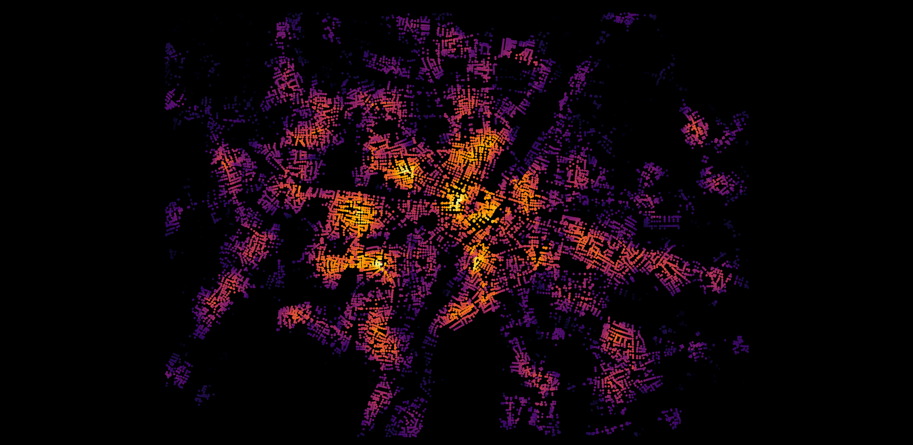
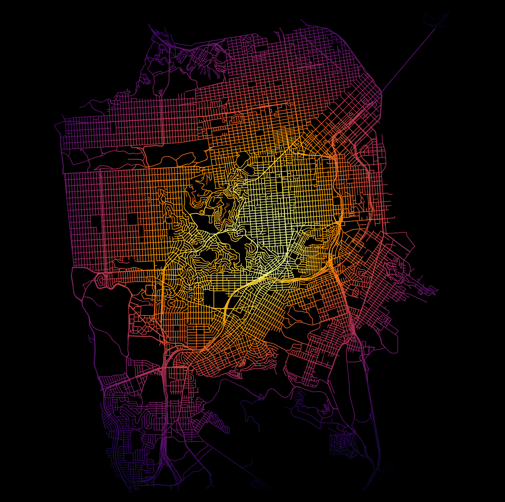
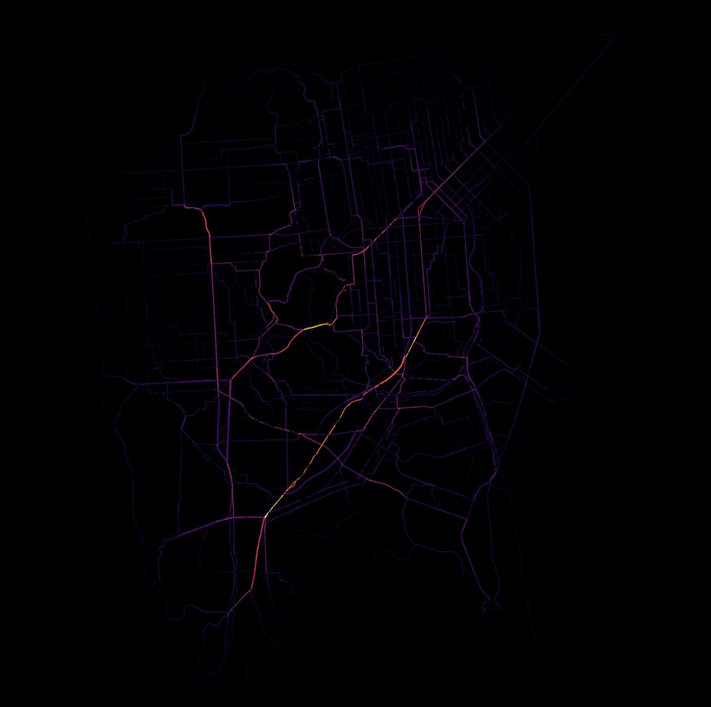

# large-scale-graph-metrics
Get centralities for large scale graphs/ networks

## Brief Summary
- Using OSMnx and i-graph, this code can quickly get the closeness and betweenness centralities for large-scale networks.
- Trick is using the i-graph instead of networkx for centrality computation. Motivation: [Issue #153](https://github.com/gboeing/osmnx/issues/153) on osmnx

## Usage
It accepts the following arguments:
- **city_name**: for save_file name
- **bounding_box**: a list with in NESW e.g.,[48.22,11.75,48.04,11.38]
- **create_by**: osmnx network creation argument = sys.argv[2]
- **centrality_type**: closeness or betweenness
- **centrality_cutoff**: cutt-off distance in metres beyond which nodes will not be considered for closeness centrality.

```sh
python munich [48.22,11.75,48.04,11.38] bbox closeness 10000
```

## Output


#### Munich closeness, cut-off=1000m


#### Munich edge betweenness


#### San Francisco closeness


#### San Francisco betweenness


## Acknowledgements
- osmnx (a really beautifull library)
- eevrything else (i-graph, networkx, OSM)